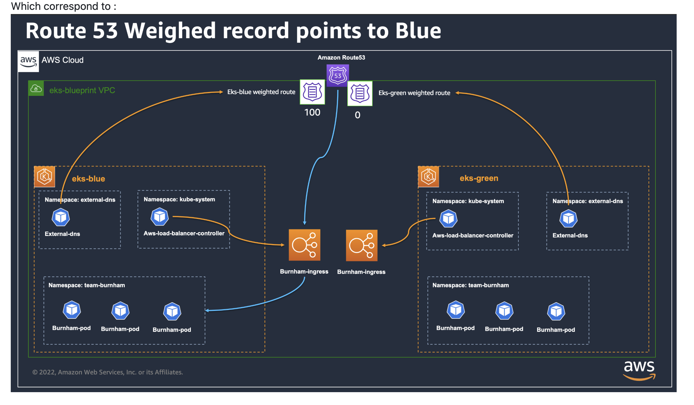
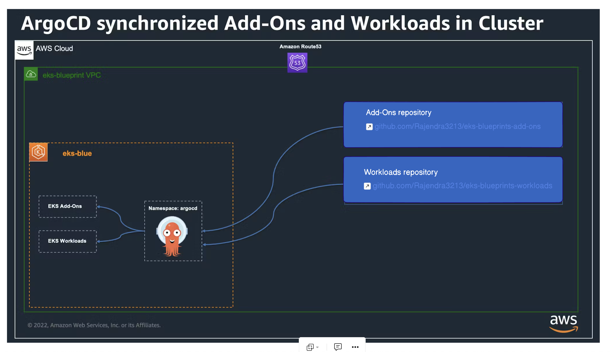

# Multi-Region and Blue-Green Deployment on EKS with IaC

Enterprise-grade Kubernetes deployment patterns using Amazon EKS, featuring multi-region architecture and blue-green deployment strategies.

## Architecture Overview

### Multi-Region Architecture


Global deployment with AWS Global Accelerator for optimized routing and automatic failover between regions.

### Blue-Green Deployment
Traffic management using Route53 weighted routing for zero-downtime deployments.




### ArgoCD GitOps



## Projects

### 1. [Multi-Region EKS](./multi-region-k8s/)
- Global Accelerator with static anycast IPs
- Cross-region failover
- Transit Gateway connectivity
- Primary (us-east-1) and Secondary (us-west-2) clusters

### 2. [Blue-Green Deployment](./blue-green-deployment/)
- Route53 weighted routing
- ArgoCD GitOps automation
- AWS Load Balancer Controller
- External DNS integration
- Zero-downtime migrations

## Quick Start

```bash
# Multi-Region
cd multi-region-k8s
terraform init && terraform apply

# Blue-Green
cd blue-green-deployment/environment && terraform apply
cd ../eks-blue && terraform apply
cd ../eks-green && terraform apply
```

## Prerequisites

- Terraform >= 1.3
- AWS CLI
- kubectl
- Route53 hosted zone
- GitHub SSH key in AWS Secrets Manager

## Key Features

✅ Multi-region high availability  
✅ Automated failover  
✅ GitOps with ArgoCD  
✅ Zero-downtime deployments  
✅ Infrastructure as Code  
✅ Canary and blue-green strategies
