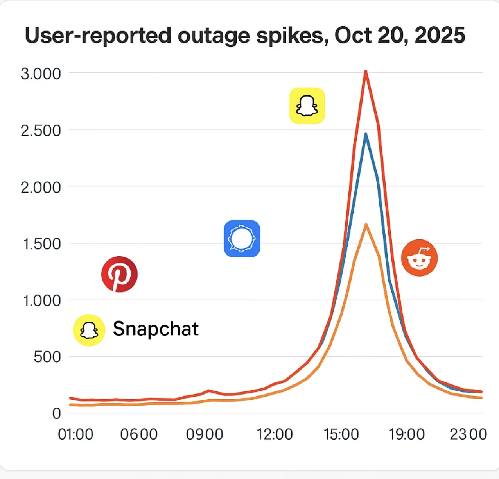
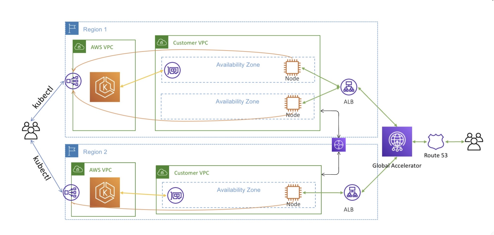
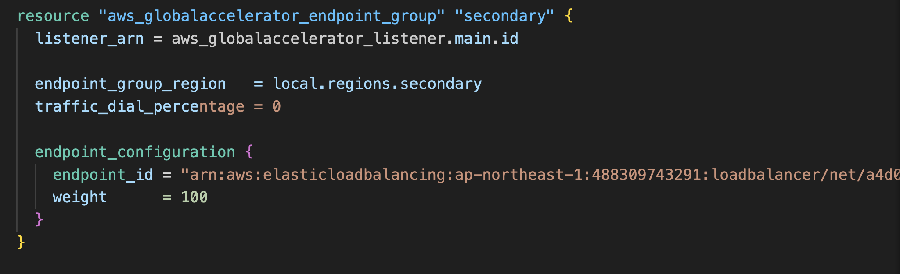
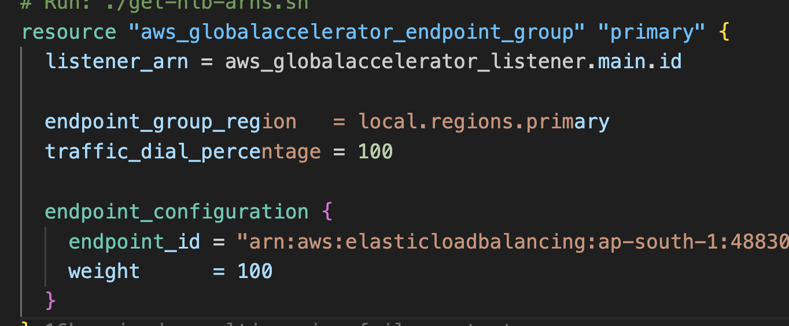
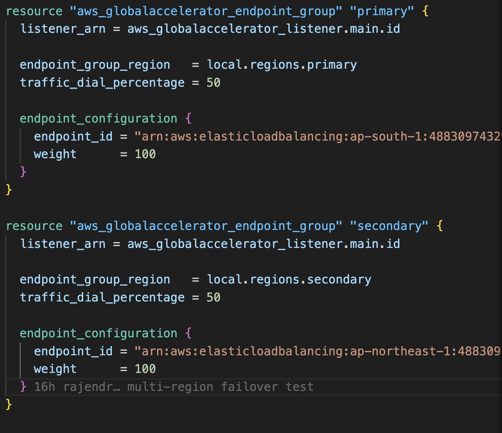
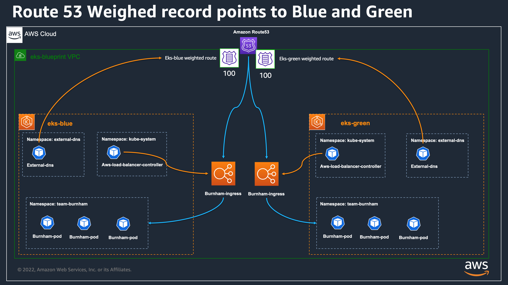
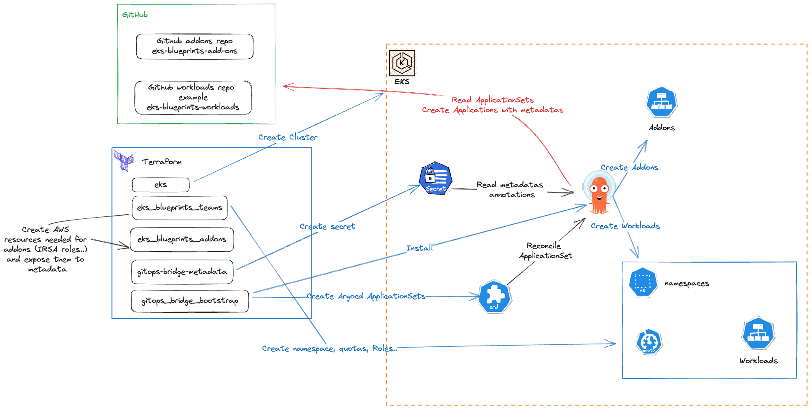

# Multi-Region EKS with Global Accelerator
## High Availability Kubernetes on AWS

---
# Why Multi-Region ?
#### AWS US‑EAST‑1 Outage (October 20–21, 2025)

---

# Who survives or is less affected?

---
# Architecture Overview

**Multi-region stateless applications using Amazon EKS**

## Key Components:
- **EKS Clusters**: Primary (us-east-1) and Secondary (us-west-2)
- **Global Accelerator**: Static anycast IPs with automatic failover
- **Route53**: DNS management with alias records
- **Network Load Balancers**: Regional endpoints
- **Transit Gateway**: Cross-region connectivity

---
# Deployment Architecture

---
# Network Architecture & Traffic Flow

## Regional Setup:
- **Primary (us-east-1)**: VPC `10.0.0.0/16`, 3 AZs, EKS v1.31
- **Secondary (us-west-2)**: VPC `10.1.0.0/16`, 3 AZs, EKS v1.31
- **Worker Nodes**: t3.medium (Min: 1, Max: 6, Desired: 3)
- **Application**: Nginx (3 replicas/region)

---
# Traffic Flow:
1. Client → Global Accelerator (anycast IPs)
2. Global Accelerator → Regional NLB (primary: 100%)
3. NLB → EKS Service LoadBalancer
4. Service → Application Pods

---

# Global Accelerator & Failover

## Static IPs:
- `52.223.29.64` / `166.117.186.20`

## Configuration:
- **Protocol**: TCP Port 80
- **Affinity**: SOURCE_IP
- **Primary**: 100% (active)
- **Secondary**: 0% (standby)

--- 
## Failover Mechanism:
- **Health Checks**: Global Accelerator monitors NLB health
- **Automatic Failover**: Traffic shifts to secondary region on failure
- **Traffic Dial**: Gradual traffic shifting (0-100%)

---

# Transit Gateway: Cross-Region Connectivity

## Purpose:
- **Private VPC peering** between regions (10.0.0.0/16 <--> 10.1.0.0/16)
- **Pod-to-pod communication** across EKS clusters
- **Shared services** access (databases, caching, monitoring)

## Use Cases:
- Stateful applications requiring cross-region sync
- Centralized logging/monitoring infrastructure
- Multi-region microservices communication

---

# Demo

---

---

---

# Blue Green Deployment ?

---

### Why Blue-Green 
- Minimize downtime during upgrades
- Easy rollback to previous version
- Safer testing in production: Green can be fully tested before live traffic hits it.

---

### EKS-Blue-Green deployment setup

---

### Argo Rollout setup

---

---

# Tips
- Build and Deploy GREEN
- Run Health Checks + alarms
- Shift 10% traffic to GREEN
- Monitor logs + metrices
- Gradually increases traffic ( 50 % --> 100%)

---
# Demo

---

---

---
# Thanks

## Questions?

---
# Let's talk infrastructures

